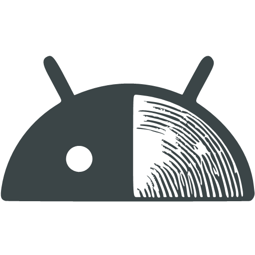
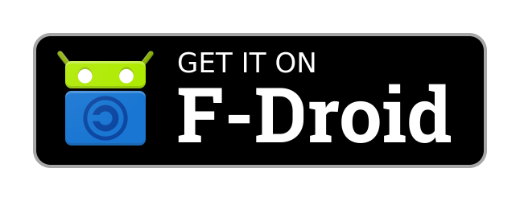
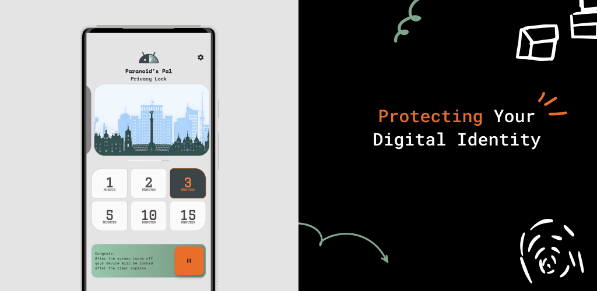
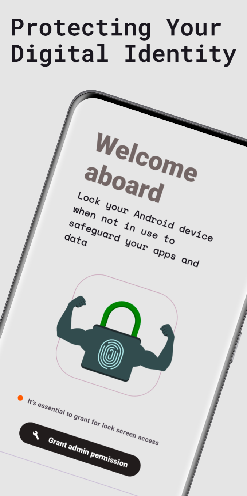
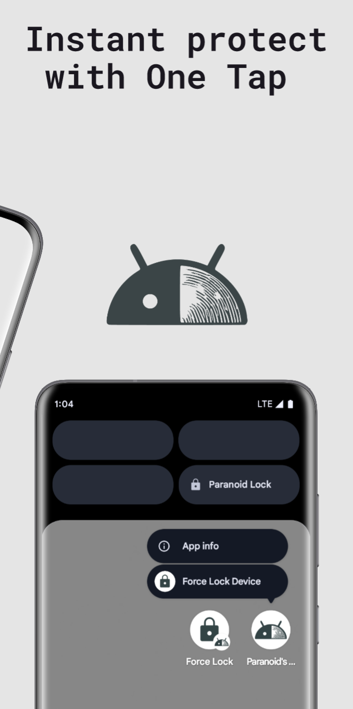
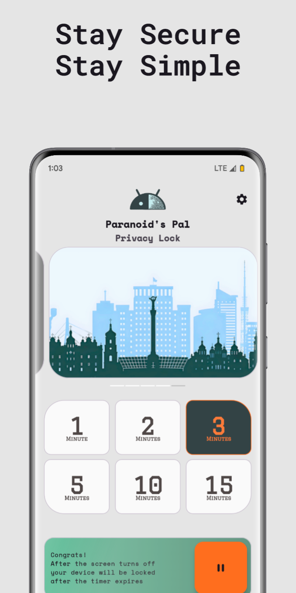

<h1 align="center" style="font-size:28px; line-height:1"><b>Paranoid's Pal - Privacy Lock</b></h1>

  

 

 

 
 

|                                |                                |                                |
|--------------------------------|--------------------------------|--------------------------------|
|  |  |  |

It’s important to lock your Android device when you aren’t using it so that nobody else can get access to your apps and data.

Your fingerprint - your security. It's convenient but not completely secure. We've worked to strike a balance making it both convenient and secure.
## Features that are already available

- **Automatic Screen Lock.** Once your screen turns off your phone locks right away making sure it stays secure even when you’re not actively using it.
- **Instant Lock with Shake** If you’re ever in a situation where you need to secure your phone in a flash just give it a quick shake and it locks immediately no questions asked. Perfect for those moments when you feel something’s not right.
- **Quick Tile Settings.** Quick Settings are tiles displayed in the Quick Settings panel, representing actions, that users can tap to quickly complete instant lock.
- **Shortcuts.** Helps your quickly start common or recommended tasks within your app.
- **Modern UI.** Enjoy a visually appealing and modern interface, following the principles of the Material You design.
- **Works offline and respects your privacy.** Paranoid's Pal operates independently without needing an internet connection or online account registration. Your confidential data always remains on your device. Neither the developers nor any third parties can access your information.

## What do you think?

You're welcome to share your thoughts, suggest features, and ask questions in [GitHub discussions](https://github.com/hardalgorithm/ParanoidsPal-PrivacyLock/discussions)!

## License

The project is licensed under the GPL, which means that you can freely build on top of it for commercial and non-commercial purposes alike. But should you choose to incorporate its code, you must open-source your project and apply the GPL license to it as well. Check out the [LICENSE](https://github.com/hardalgorithm/ParanoidsPal-PrivacyLock/blob/master/LICENSE) file for more details.
